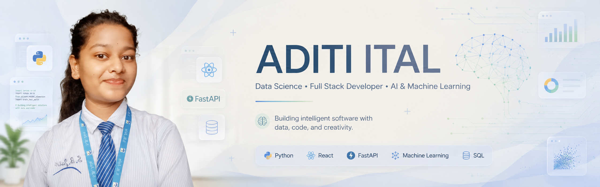

 
<div align="center">

<p align="center">
  
</p>
<p align="center">

</p>

# Hie✨, I'm Aditi Ital

### 💜 Data Science Student • Full Stack Developer • AI & Machine Learning Algorithm


<p>


</p>

</div>


# 💜 About Me

```yaml
Name: Aditi Ital

Education:
  B.Tech Computer Science Engineering
  Specialization: Data Science

Location:
  Nagpur, Maharashtra, India

Currently Learning:
  - Artificial Intelligence
  - Machine Learning
  - React
  - FastAPI
  - Cloud Computing
  - DSA

Interests:
  - Full Stack Development
  - AI Applications
  - Data Visualization
  - Open Source

Mission:
  Build impactful software that solves real-world problems.
```


# ⚡ Tech Stack

<div align="center">


</div>

<p align="center">


</p>


# 📊 Development Focus

<div align="center">

| Technology | Progress |
|------------|----------|
| 🐍 Python | ██████████████ 90% |
| 🤖 Artificial Intelligence | █████████████ 85% |
| 🧠 Machine Learning | ████████████ 80% |
| ⚛ React | ███████████ 75% |
| ⚡ FastAPI | ██████████ 70% |
| 📊 Data Science | ████████████ 80% |
| 💻 Full Stack Development | ████████████ 80% |

</div>


# 🏆 GitHub Achievements

<div align="center">


</div>


# 📈 Contribution Activity

<div align="center">


</div>


# 🚀 Featured Projects

<table>

<tr>

<td width="50%">

## 🤖 Smart Job Recommendation

AI Powered Job Recommendation Platform

💜 React

💜 FastAPI

💜 Machine Learning

💜 Python

⭐ [Repository](https://github.com/aditiital/Smart-Job-Recommendation-System)

</td>

<td width="50%">

## 📚 Smart Library

Library Management with WhatsApp Notifications

💜 Node.js

💜 HTML

💜 JavaScript

💜 MySQL

⭐ [Repository](https://github.com/aditiital/smart_liabrary_management)

</td>

</tr>

<tr>

<td>

## 🎓 Student Score Prediction

Machine Learning Prediction System

💜 R

💜 Data Analysis

💜 ML

⭐ Repository

</td>

<td>

## 🎂 WishBloom

Animated Birthday Website

💜 React

💜 CSS

💜 Animations

⭐ Repository

</td>

</tr>

</table>

# 🚧 Currently Working On

- 🤖 AI Powered Applications
- 💜 WishBloom - Interactive Birthday Website
- 🌐 Full Stack Development
- 📊 Data Science Projects
- 🚀 Open Source Contributions


# 🌱 Currently Exploring

- 🤖 Artificial Intelligence
- 📊 Data Science
- ⚛ React Ecosystem
- ⚡ FastAPI
- ☁ Cloud Computing
- 🌍 Open Source
- 💻 Data Structures & Algorithms


## 🌐 Connect With Me

<p align="center">
  <a href="https://github.com/aditiital" target="_blank">
    
  </a>

  <a href="mainto:aditiital12@gmail.com">
    
  </a>

  <a href="https://www.linkedin.com/in/aditi-ital-31am12/">
    
  </a>
</p>


<div align="center">

### ✨ "Learning • Building • Growing • One Commit at a Time."

</div>

# 💭 Developer Philosophy

> "I believe technology becomes meaningful when it solves real-world problems. Every project I build is another step toward becoming a better developer."


# 💻 Coding Profiles

<p align="center">

<a href="https://github.com/aditiital">

</a>

<a href="#">

</a>

<a href="https://www.hackerrank.com/profile/aditiital_aids23">

</a>

</p>


## 🐍 Contribution Snake

<p align="center">
  <picture>
    <p align="center">
  
</p>
  </picture>
</p>

</p>


<div align="center">

<h2>Thanks for Visiting...💜!</h2>

<p>
Always learning • Always building • One commit at a time.
</p>

<p>
⭐ If you like my work, consider following my journey.
</p>

<p>
Made with 🤍 by <strong>Aditi Ital</strong>
</p>

</div>


</div>